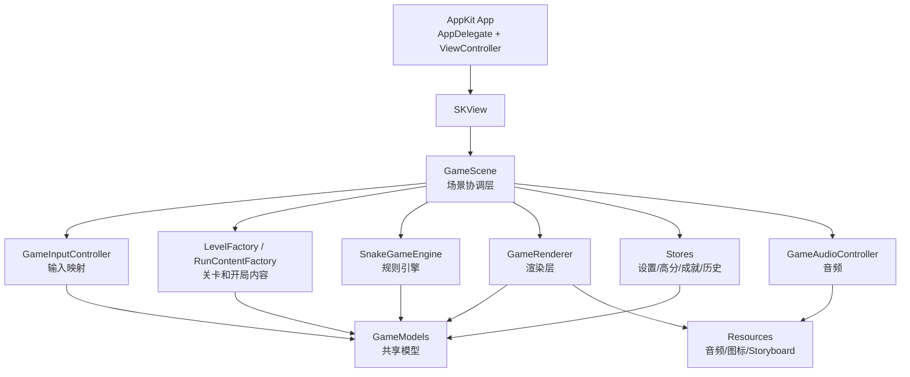
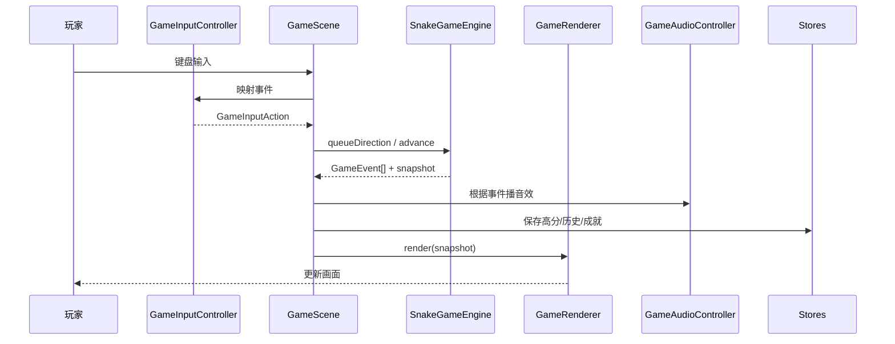

# Snake Orchard 当前项目技术方案

面向对象：有前端开发经验，但没有游戏开发经验的工程师。

目标：把这个项目现在的代码架构、模块职责、数据流、关键概念和扩展方式讲透。读完之后，你应该能回答这几个问题：

- 这个原生 Mac 游戏是怎么启动起来的？
- 游戏逻辑、渲染、输入、音频、存储分别放在哪一层？
- `GameScene`、`SnakeGameEngine`、`GameRenderer` 之间到底怎么协作？
- 如果继续加玩法，应该改哪里，尽量不要改哪里？

---

## 1. 一句话理解这个项目

这个项目本质上是：

`AppKit` 提供 Mac 应用和窗口外壳，`SpriteKit` 提供 2D 游戏场景和渲染能力，项目自己的代码把“贪吃蛇世界状态”封装成一个独立规则引擎，再通过场景层把输入、引擎、渲染、音频和存储串起来。

如果用前端类比：

- `AppKit` 像浏览器和桌面窗口壳
- `ViewController` 像页面入口
- `SKView` 像一个专门跑游戏的 `<canvas>`
- `GameScene` 像这个页面的 orchestrator
- `SnakeGameEngine` 像一个纯业务状态机 / reducer
- `GameRenderer` 像把 state 渲染成画面的 view 层

---

## 2. 当前目录分层

项目主代码目录在 `贪吃蛇/`，已经按职责拆成了几层：

```text
贪吃蛇/
├─ App/
│  ├─ AppDelegate.swift
│  └─ ViewController.swift
├─ Core/
│  ├─ Models/
│  │  └─ GameModels.swift
│  ├─ Engine/
│  │  ├─ InputController.swift
│  │  ├─ LevelFactory.swift
│  │  ├─ RunContentFactory.swift
│  │  └─ SnakeGameEngine.swift
│  └─ Infrastructure/
│     ├─ AchievementStore.swift
│     ├─ GameAudioController.swift
│     ├─ GameSettingsStore.swift
│     ├─ HighScoreStore.swift
│     └─ RunHistoryStore.swift
├─ Game/
│  ├─ Rendering/
│  │  └─ GameRenderer.swift
│  └─ Scenes/
│     └─ GameScene.swift
└─ Resources/
   ├─ Assets.xcassets
   ├─ Audio/
   ├─ Base.lproj/Main.storyboard
   └─ *.sks
```

这套分层的核心思想是：

- `Core/Models` 只放共享数据结构
- `Core/Engine` 只放规则和输入映射
- `Core/Infrastructure` 放平台能力和持久化
- `Game/Scenes` 负责协调
- `Game/Rendering` 负责画面
- `Resources` 放素材

这和成熟前端项目里常见的：

- `types`
- `domain`
- `services`
- `storage`
- `views`
- `pages`

是同一种思路。

---

## 3. 技术栈和框架职责

### 3.1 AppKit / Cocoa

作用：

- 启动原生 macOS 应用
- 创建窗口
- 处理应用生命周期
- 接收键盘事件
- 处理窗口关闭和应用退出

当前对应代码：

- `App/AppDelegate.swift`
- `App/ViewController.swift`

前端类比：

- `main.tsx` + 应用壳 + 路由外层容器

### 3.2 SpriteKit

作用：

- `SKView`：承载游戏场景
- `SKScene`：游戏页面 / 场景
- `SKNode`：场景树节点
- `SKShapeNode` / `SKLabelNode`：绘图和文本
- `update(_:)`：每帧驱动

当前对应代码：

- `Game/Scenes/GameScene.swift`
- `Game/Rendering/GameRenderer.swift`

前端类比：

- 更接近 `canvas + scene graph`，不是 DOM

### 3.3 Foundation

作用：

- 时间、集合、随机数、字典、数组
- 存储配置和状态

### 3.4 AVFoundation

作用：

- 播放音效和循环背景音乐

当前对应代码：

- `Core/Infrastructure/GameAudioController.swift`

### 3.5 UserDefaults

作用：

- 本地持久化最高分、设置、成就、历史摘要

当前对应代码：

- `HighScoreStore`
- `GameSettingsStore`
- `AchievementStore`
- `RunHistoryStore`

前端类比：

- 像浏览器里的 `localStorage`，但更适合原生应用

---

## 4. 项目整体分层图



你可以把 `GameScene` 理解成“总调度器”，但不是“业务大杂烩”。

它本身不负责：

- 计算蛇怎么移动
- 计算是否撞到自己
- 计算水果如何刷新
- 计算分数
- 画具体节点

这些都被拆给了更单一的模块。

---

## 5. 从启动到出现画面的完整链路

### 第 1 步：App 启动

`AppDelegate` 是应用生命周期入口。当前它做得很轻，但有一条关键行为：

- 关闭最后一个窗口后自动退出应用

这解决了“窗口关了但声音还在”的问题。

### 第 2 步：Storyboard 创建窗口和 `SKView`

`Resources/Base.lproj/Main.storyboard` 定义窗口结构。

其中会创建一个 `SKView`，并交给 `ViewController` 管理。

### 第 3 步：`ViewController` 创建 `GameScene`

在 `App/ViewController.swift` 里：

- 创建 `GameScene`
- 设置 `scaleMode = .resizeFill`
- 调用 `skView.presentScene(scene)`
- 把键盘焦点切到 `SKView`

这一步相当于前端里的：

- 创建页面根组件
- 把它 mount 到容器里

### 第 4 步：`GameScene.didMove(to:)` 初始化系统

在 `Game/Scenes/GameScene.swift` 里，`didMove(to:)` 会做这些事：

1. 读用户设置
2. 应用音频设置
3. 应用速度预设到引擎
4. 让渲染器挂到当前场景
5. 生成一局预览局
6. 切到主菜单
7. 同步音频模式
8. 首次渲染

也就是说，真正的“游戏初始化”是在这里，而不是在 `ViewController`。

---

## 6. `GameScene` 的职责

`GameScene` 是场景协调层，不是规则层。

### 它负责什么

- 接收来自 `SKScene` 的生命周期
- 接收键盘输入
- 控制当前页面模式
- 驱动固定步长更新
- 调用引擎推进状态
- 把引擎输出交给渲染器
- 把事件交给音频和存储系统

### 它不负责什么

- 不做蛇碰撞判定
- 不做水果刷新规则
- 不做关卡定义
- 不直接画格子、蛇和水果

### 当前的场景模式

`SceneMode` 里现在有：

- `mainMenu`
- `achievements`
- `help`
- `ready`
- `playing`
- `paused`
- `gameOver`
- `settings`

这相当于前端里的页面 UI state。

### 为什么这一层很重要

很多初学游戏项目会把所有逻辑都写进 `GameScene`。

那样短期很快，但后期会出问题：

- 输入逻辑和业务逻辑混在一起
- 渲染逻辑和状态逻辑耦合
- 菜单、暂停、结算越来越难加

当前项目已经避免了这个问题。

---

## 7. 输入系统：`GameInputController`

文件：`Core/Engine/InputController.swift`

职责：

- 把 `NSEvent` 转成内部动作 `GameInputAction`

当前动作类型：

- `changeDirection(Direction)`
- `primaryAction`
- `togglePause`
- `secondaryAction`

这层的意义很像前端里的“事件适配层”：

- 浏览器事件 / 原生事件是平台格式
- 业务想要的是内部动作格式

这样做的好处是：

- 以后改键位，不用改引擎
- 以后支持手柄，也可以在这里新增映射

---

## 8. 游戏循环：为什么游戏不是事件驱动，而是时间驱动

前端应用多数是“事件驱动”：

- 点按钮才更新
- 请求返回才更新

游戏不是。

游戏更像：

- 程序一直在跑
- 每一帧都可能推进世界
- 用户不操作，世界也会继续变化

### 当前项目的做法

`GameScene.update(_:)` 使用了“固定逻辑步长 + 补帧”模式：

1. 计算这一帧过去了多久 `delta`
2. 把 `delta` 累加进 `timeAccumulator`
3. 当累积时间大于 `engine.tickDuration` 时，推进一次逻辑
4. 一帧里最多推进 3 次，防止极端积压
5. 本帧推进结束后只渲染一次

这个模式的作用是：

- 贪吃蛇这种格子游戏更稳定
- 不会因为帧率波动就让移动速度忽快忽慢
- 修复了极速模式下“一帧多次推进 + 每次都重绘”的卡顿问题

前端类比：

- 像 `requestAnimationFrame`
- 但逻辑更新不是完全跟着每帧像素走，而是有固定 tick

---

## 9. 共享模型层：`GameModels`

这个文件是整个项目的“领域语言”。

### 9.1 基础世界模型

- `GridPoint`：网格坐标
- `Direction`：移动方向
- `FruitKind`：水果种类
- `FruitEffect`：水果效果
- `FruitDefinition`：某个水果实例
- `LevelDefinition`：关卡定义

### 9.2 游戏扩展内容

- `RunModifier`：每局词条
- `MissionDefinition` / `MissionProgress`：任务
- `AchievementDefinition`：成就
- `DynamicMechanicDefinition`：动态机关
- `TemporaryHazardSnapshot`：临时危险区

### 9.3 UI 和协调层模型

- `GameSnapshot`：渲染快照
- `OverlayMenuState`：菜单 overlay 数据
- `OverlayMenuItem`：菜单项数据
- `SceneMode`：场景模式
- `GameEvent`：运行期事件

### 为什么这层重要

它相当于前端项目里的：

- `types.ts`
- `domain.ts`
- `shared/models`

没有这层，后面的引擎和渲染会互相“偷看实现细节”。

有了这层之后：

- 引擎只关心状态
- 渲染只消费快照
- 场景只拼装系统

---

## 10. 规则引擎：`SnakeGameEngine`

这是整个项目最核心的业务层。

你可以把它理解成：

“一个持续运行的、带时间推进的 reducer”

### 10.1 引擎持有哪些状态

它内部维护的不是 UI，而是世界状态：

- 当前关卡
- 当前词条
- 当前任务
- 蛇身
- 当前水果
- 当前分数
- 高分
- 机关状态
- 临时危险区
- 运行统计
- 特效剩余步数
- 连击窗口
- 倒计时水果剩余步数

### 10.2 `advance()` 做了什么

每推进一步，大致做这些事：

1. 应用待生效方向
2. 计算蛇头下一格
3. 判断是否吃到水果
4. 判断是否撞墙 / 静态障碍 / 动态机关 / 临时危险区 / 自己
5. 更新蛇身
6. 处理增长
7. 更新水果特效状态
8. 更新倒计时水果
9. 推进机关 tick
10. 推进临时危险区寿命
11. 更新任务进度
12. 发出事件

这就是完整的“规则推进”。

### 10.3 为什么引擎要发 `GameEvent`

引擎不直接播放音效，也不直接画动画。

它只发语义化事件，例如：

- `ateFruit`
- `comboAdvanced`
- `fruitExpired`
- `bombTriggered`
- `floorCollapsed`
- `gameOver`

然后由 `GameScene` 把这些事件交给：

- `GameAudioController`
- `GameRenderer`
- 存储层

这和前端里“reducer 不做 DOM 操作，只发状态变化”是一个思想。

### 10.4 当前玩法系统都在这一层

已经接进去的玩法包括：

- 五种水果基础成长
- 柚子 `+2`
- 特殊水果：`golden / frost / ghost / warp / bomb`
- 连击系统
- 倒计时水果
- 动态机关
- 爆裂危险区
- 塌陷地板
- 随机关卡
- 随机词条
- 随机任务

所以引擎已经不是“简单贪吃蛇”，而是一个完整的小型玩法系统。

---

## 11. 关卡和开局内容：`LevelFactory` + `RunContentFactory`

### `LevelFactory`

负责：

- 定义所有关卡布局
- 控制静态障碍
- 控制动态机关
- 控制哪些关卡开启塌陷地板

关卡本质上是“配置数据”，不是逻辑代码。

当前已有的关卡包括：

- 普通静态图
- 动态机关图
- 塌陷地板图 `浮桥`

### `RunContentFactory`

负责：

- 生成随机词条
- 生成随机任务

### 为什么要拆出去

如果关卡和任务逻辑都塞进引擎：

- 引擎会越来越大
- 测试和调参会越来越困难

拆出去之后：

- 改关卡不改引擎
- 改任务池不改引擎

这就是典型的“配置驱动逻辑”。

---

## 12. 渲染层：`GameRenderer`

`GameRenderer` 只负责一件事：

把 `GameSnapshot` 画成 SpriteKit 节点。

### 它包含哪些视觉层

- `backdropLayer`：背景装饰
- `boardContainer`：棋盘容器
- `obstacleLayer`：静态障碍
- `dynamicObstacleLayer`：动态机关
- `temporaryHazardLayer`：爆炸区 / 塌陷区
- `fruitLayer`：水果
- `snakeLayer`：蛇
- `hudLayer`：HUD
- `overlayLayer`：菜单 / 暂停 / 结算层

这和前端里把页面拆成多个语义层类似，只不过这里是空间渲染层级。

### 它做的核心工作

- 根据窗口尺寸计算棋盘布局
- 画棋盘网格
- 画障碍和动态机关
- 画蛇
- 画水果和 aura
- 画倒计时
- 画临时危险区
- 画 HUD
- 画菜单和结算页
- 根据事件做视觉反馈

### 它不做什么

- 不决定哪个水果该出现
- 不决定危险区持续几步
- 不决定是否死亡

这些都属于引擎层。

### 为什么渲染层要吃 `GameSnapshot`

因为渲染层不应该依赖一堆零散字段。

`GameSnapshot` 就像前端里的“ViewModel”：

- 它已经是适合渲染的结构
- 渲染器拿到就能画

这样能避免 renderer 和 engine 互相强耦合。

---

## 13. 存储层：本地持久化是怎么做的

这个项目有 4 个 store：

- `HighScoreStore`
- `GameSettingsStore`
- `AchievementStore`
- `RunHistoryStore`

它们都很克制：只负责本地持久化，不负责业务判断。

### 为什么这样设计

比如成就系统：

- “达成条件是什么”在模型层
- “当前局有没有解锁”在引擎 / 场景层组合
- “解锁后怎么保存”在 `AchievementStore`

这就是职责边界清晰的做法。

如果 store 也参与业务判断，后面就会越来越像“全能类”。

---

## 14. 音频层：`GameAudioController`

音频层基于 `AVAudioPlayer`，负责：

- 音效
- 菜单 BGM
- 对局 BGM
- 音乐模式切换
- 响应设置开关

### 当前的音频模式

- `menu`
- `gameplay`
- `silent`

`GameScene` 根据当前 `SceneMode` 切换音频模式。

### 一个真实踩坑

项目里之前出现过：

- 资源确实打包了
- 但播放器按错误子目录查找
- 结果所有声音都不生效

后来改成：

- 先找 `Audio/`
- 再回退到 bundle 根目录

这就是原生开发里常见的“资源路径和打包结构要对齐”的问题。

---

## 15. 主菜单、设置、结算页是怎么做的

这个项目没有为菜单再单独建一个 Scene。

而是复用了同一个 `overlayLayer` 系统。

### 做法

1. `GameScene` 根据当前模式生成 `OverlayMenuState`
2. `GameRenderer` 根据 `OverlayMenuLayout` 渲染成列表或徽章卡片

### 好处

- 不需要复制一套菜单场景
- 菜单 / 帮助 / 设置 / 成就 / 结算都走同一套协议
- 后面扩功能时只要增加模式和菜单项

这和前端里“一个 Modal / Panel 组件通过 props 复用多个页面”很像。

---

## 16. 当前项目的数据流

下面是一次正常游戏循环的数据流：



注意：

- 输入不会直接改渲染
- 渲染不会直接改引擎
- store 不直接改场景

这就是解耦。

---

## 17. 用前端工程师最熟的语言重新解释一次

可以把当前项目粗暴地翻译成下面这个对应关系：

### App 层

- `AppDelegate` = 应用生命周期入口
- `ViewController` = 页面入口组件

### Store / Domain 层

- `GameModels` = TypeScript 类型 + 领域模型
- `SnakeGameEngine` = reducer + domain service
- `LevelFactory` = mock/config factory
- `RunContentFactory` = 开局配置生成器

### View 层

- `GameRenderer` = 纯渲染 view
- `OverlayMenuState` = view model

### Controller / Orchestrator 层

- `GameScene` = 页面控制器 + 动画时钟 + 业务调度器

### Infra 层

- `GameAudioController` = 音频 service
- `*Store` = persistence adapter

如果你能理解 React / Redux / Zustand / Canvas 游戏页面，那么这个项目的结构并不陌生，只是渲染对象从 DOM 变成了 SpriteKit 节点，更新时机从“事件触发”变成了“事件 + 时间驱动”。

---

## 18. 当前架构的优点

### 18.1 职责已经比较清晰

`GameScene`、`SnakeGameEngine`、`GameRenderer` 的边界很清楚。

### 18.2 很适合继续加玩法

你现在要加：

- 新水果效果
- 新机关
- 新关卡
- 新任务

大多数都能落在单一模块里改。

### 18.3 持久化和平台能力没有污染业务层

设置、高分、成就、历史都没有直接塞进引擎。

### 18.4 渲染协议已经抽出来了

`GameSnapshot` 是个很好的边界对象。

---

## 19. 当前架构的局限

### 19.1 `GameModels.swift` 已经开始偏大

原因：

- 共享模型越来越多
- 菜单模型、成就模型、玩法模型都在同一个文件

后续建议拆成：

- `Core/Models/WorldModels.swift`
- `Core/Models/RunModels.swift`
- `Core/Models/UIMenuModels.swift`

### 19.2 `SnakeGameEngine` 体量正在变大

现在它已经同时负责：

- 基础蛇规则
- 特殊水果
- 动态机关
- 连击
- 倒计时
- 临时危险区

继续长下去后，建议拆：

- `SnakeMovementSystem`
- `FruitSystem`
- `HazardSystem`
- `MissionSystem`

或者更简单点，拆成私有扩展文件。

### 19.3 渲染器仍然是单文件

虽然职责比 `GameScene` 清晰，但文件已经不小了。

可继续拆为：

- `BoardRenderer`
- `HUDRenderer`
- `OverlayRenderer`
- `EffectRenderer`

### 19.4 菜单模式还是枚举驱动

对当前规模是对的，但如果以后要做更复杂的 UI 流程，例如：

- 多级设置页
- 成就详情页
- 图鉴页

可能需要更明确的状态机。

---

## 20. 后续扩展应该怎么做

### 加一个新水果效果

推荐改动路径：

1. 在 `FruitEffect` 增加新 case
2. 在 `SnakeGameEngine.randomEffect()` 加生成概率
3. 在 `advance()` 里定义规则作用
4. 在 `GameRenderer` 里补视觉和提示
5. 在帮助页文案补说明

### 加一个新机关

推荐改动路径：

1. 在 `GameModels` 增加定义结构
2. 在 `DynamicMechanicDefinition` 增加 case
3. 实现 `snapshot(at:)` 和 `statusText(at:)`
4. 在 `LevelFactory` 里加新关卡
5. 在 `GameRenderer.renderDynamicObstacles` 加视觉样式

### 加一个新局外系统

例如成就页详情、皮肤解锁、排行榜：

推荐优先放在：

- `Core/Infrastructure`
- `Core/Models`
- `GameScene`

尽量不要先塞进 `SnakeGameEngine`，除非它会影响局内规则。

---

## 21. 如果我要继续重构，我会怎么做

优先级从高到低：

### 第一优先级

拆 `GameModels.swift`

原因：

- 这是当前增长最快的文件
- 它已经承担太多概念

### 第二优先级

拆 `SnakeGameEngine.swift`

原因：

- 玩法越来越多
- 后面会更需要局部测试和调数值

### 第三优先级

把音频资源和视觉参数做成配置

原因：

- 现在很多值仍然是写死的
- 后续要平衡或换素材时，改代码成本偏高

### 第四优先级

补测试

最值得先测的是：

- 吃水果增长
- 自撞 / 穿身 / 穿墙边界
- 倒计时水果刷新
- 爆炸区和塌陷区寿命
- 任务完成条件

---

## 22. 总结

当前这个项目已经不是“把贪吃蛇写出来”的 Demo 结构了，而是一个具备持续演进能力的小型原生游戏架构。

它最关键的优点不是用了多少框架，而是做对了这几个边界：

- `GameScene` 负责协调，不负责业务细节
- `SnakeGameEngine` 负责规则，不负责 UI 和音频
- `GameRenderer` 负责显示，不负责规则判断
- `Store` 负责持久化，不负责玩法
- `GameModels` 负责统一语言，不负责执行

对一个前端工程师来说，最重要的认知迁移不是“学会 SpriteKit API”，而是理解：

- 游戏是时间驱动的
- 世界状态和 UI 状态不是一回事
- 渲染层应该消费快照，而不是反向控制业务
- 一个小游戏同样需要模块边界

把这几件事理解透，后面你再加机关、菜单、成就、Boss、皮肤、排行榜，都会顺很多。
