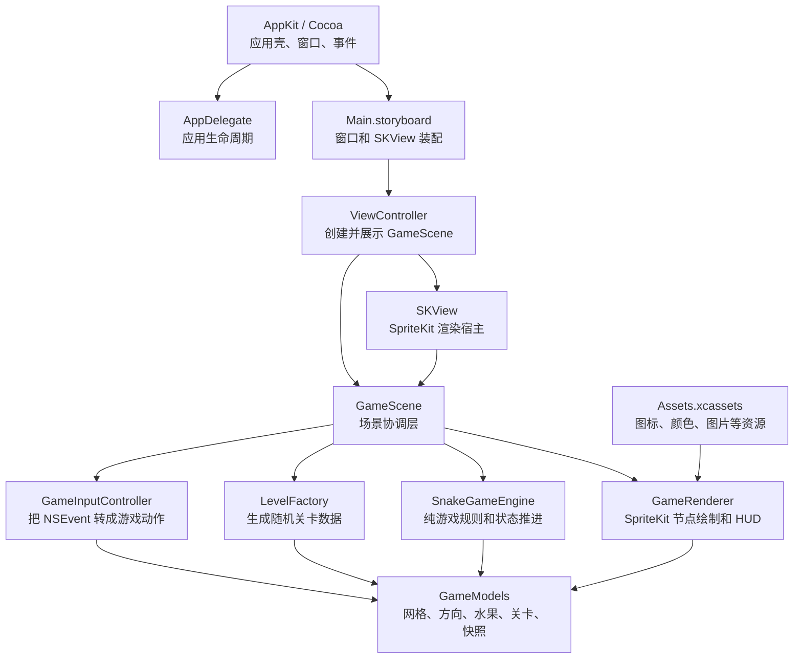

# 原生 Mac 游戏架构图

## 模块职责

- `AppDelegate`：应用启动和退出的生命周期入口。
- `Main.storyboard`：定义窗口和 `SKView`，负责界面装配。
- `ViewController`：把 `GameScene` 放进 `SKView`，并确保视图拿到键盘焦点。
- `GameScene`：只负责调度，连接输入、关卡、规则引擎、渲染器和游戏循环。
- `GameInputController`：把键盘事件转换成内部动作，不处理业务规则。
- `LevelFactory`：产出关卡配置，不参与运行中的游戏状态更新。
- `SnakeGameEngine`：维护蛇、分数、水果、结束状态，负责每个 tick 的规则推进。
- `GameRenderer`：把状态快照渲染成 SpriteKit 节点和 HUD。
- `GameModels`：项目共用的数据模型和快照结构。
- `Assets.xcassets`：图标和素材资源。

## 数据流

1. `ViewController` 创建 `GameScene` 并交给 `SKView`。
2. `GameScene` 通过 `LevelFactory` 生成关卡，并用它重置 `SnakeGameEngine`。
3. 用户按键后，`GameInputController` 把系统事件转成内部动作。
4. `GameScene` 在 `update(_:)` 中按固定 tick 调用 `SnakeGameEngine.advance()`。
5. `SnakeGameEngine` 输出新的 `GameSnapshot`。
6. `GameRenderer` 根据 `GameSnapshot` 刷新 SpriteKit 节点和 HUD。
